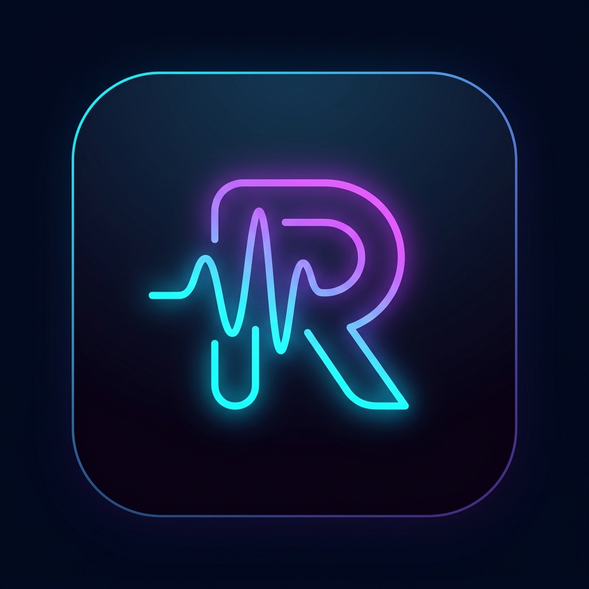

<p align="center">
  
</p>

<h1 align="center">Reson Studio</h1>

<p align="center">
  <b>A professional desktop Digital Audio Workstation (DAW) built with Electron, React, and FastAPI.</b>
</p>

<p align="center">
  
  
  
  
  
</p>

---

## ✨ Features

### 🎹 Music Creation
- **Piano Roll** — Draw, edit, resize, and arrange MIDI notes with snap-to-grid, velocity control, and multi-channel support
- **Channel Rack** — Manage instruments and synthesizers per channel
- **Pattern System** — Create and manage reusable patterns with drag-and-drop to the playlist
- **Chord Progression Generator** — AI-assisted chord generation for rapid composition

### 🎚️ Mixing & Effects
- **Multi-track Mixer** — Full mixing console with volume, panning, mute/solo per channel
- **Effect Chain Editor** — Apply audio effects (reverb, delay, EQ, compression, distortion, chorus, and more)
- **Automation Clips** — Automate volume, panning, and effect parameters over time

### 🎵 Audio & Sampling
- **Sample Editor** — Waveform visualization with region selection, trimming, and processing via WaveSurfer.js
- **Audio Clips** — Import, arrange, and slice audio files in the playlist
- **Audio Pack Library** — Browse and drag-in sample packs and audio presets
- **Audio Export** — Export projects as WAV or MP3

### 🤖 AI-Powered Tools
- **Midify** — Convert audio to MIDI using Spotify's Basic Pitch neural network
- **AI Music Generation** — Generate music using Meta's MusicGen model
- **Lyria Music** — Real-time music generation via Google's Gemini API
- **MIDI-LLM** — Text-to-MIDI generation using transformer models (requires CUDA GPU)
- **Stem Separation** — Extract vocals, drums, bass, and other stems using Demucs

### 🖥️ Desktop Application
- **Native Desktop App** — Packaged as a Windows installer with desktop shortcut via Electron + NSIS
- **Custom Title Bar** — Frameless window with integrated controls
- **File Management** — Save/load `.reson` project files with full state persistence
- **System Tray** — Minimize to tray for background operation

---

## 📂 Project Structure

```
Reson-Studio/
├── frontend/                   # Electron + React desktop app
│   ├── electron/
│   │   ├── main.js             # Electron main process (backend spawning, splash screen)
│   │   └── preload.js          # Context bridge for renderer
│   ├── src/
│   │   ├── components/         # React UI components
│   │   │   ├── PianoRoll.js    # MIDI note editor
│   │   │   ├── TrackList.js    # Playlist / arrangement view
│   │   │   ├── Mixer.js        # Mixing console
│   │   │   ├── ChannelRack.js  # Channel/instrument manager
│   │   │   ├── SampleEditor.js # Waveform editor
│   │   │   ├── EffectEditor.js # Effect chain UI
│   │   │   └── ...
│   │   ├── audio/              # Audio engine (Tone.js)
│   │   ├── contexts/           # React contexts (ProjectContext, GuideContext)
│   │   ├── services/           # API service layer
│   │   └── styles/             # CSS stylesheets
│   ├── assets/                 # App icons (PNG, ICO)
│   ├── public/                 # Static files
│   └── package.json            # Dependencies & build config
│
├── backend/                    # Python FastAPI server
│   ├── main.py                 # FastAPI app entry point
│   ├── routers/
│   │   ├── audio.py            # Audio processing endpoints
│   │   ├── effects.py          # Audio effects processing
│   │   ├── midi.py             # MIDI file handling
│   │   ├── midify.py           # Audio-to-MIDI conversion
│   │   ├── generate_music.py   # MusicGen AI generation
│   │   ├── lyria_music.py      # Gemini Lyria generation
│   │   ├── midi_llm.py         # Text-to-MIDI (transformer)
│   │   └── audiopack.py        # Sample pack management
│   ├── services/               # Business logic
│   ├── models/                 # Data models
│   └── requirements.txt        # Python dependencies
│
├── ai_models/                  # AI/ML training scripts
├── dev.bat                     # One-click development launcher
├── build-backend.bat           # PyInstaller backend bundling script
└── README.md
```

---

## 🛠️ Prerequisites

| Tool | Version | Notes |
|------|---------|-------|
| **Node.js** | v18+ | Required for frontend & Electron |
| **npm** | v9+ | Comes with Node.js |
| **Python** | v3.10+ | Required for backend |
| **pip** | Latest | Python package manager |
| **FFmpeg** | Latest | Required by pydub for audio conversion |

### Optional (for AI features)
- **CUDA GPU** — Required for MIDI-LLM and Demucs stem separation
- **Google Gemini API Key** — Required for Lyria music generation (set in `backend/.env`)

---

## 🚀 Quick Start

### Option 1: One-Click Launch (Windows)

Double-click `dev.bat` at the project root. This starts everything automatically.

### Option 2: Manual Setup

#### 1. Backend Setup

```bash
cd backend

# Create virtual environment (recommended)
python -m venv venv
venv\Scripts\activate

# Install dependencies
pip install -r requirements.txt

# Configure environment
copy .env.example .env
# Edit .env with your API keys (GEMINI_API_KEY, etc.)
```

#### 2. Frontend Setup

```bash
cd frontend

# Install dependencies
npm install
```

#### 3. Run the Application

```bash
cd frontend
npm run start
```

This single command will:
1. Start the React dev server on `http://localhost:3000`
2. Wait for it to be ready
3. Launch the Electron window (which auto-starts the Python backend on port 8000)

---

## 📦 Building for Production

### Build the Backend (standalone .exe)

```bash
# From project root
.\build-backend.bat
```

This uses PyInstaller to create `backend/dist/backend.exe` and copies it to `frontend/assets/backend/`.

### Build the Installer

```bash
cd frontend
npm run dist
```

This will:
1. Build the React production bundle
2. Package everything with electron-builder
3. Output an **NSIS installer** (.exe) in `frontend/dist/`

The installer automatically creates a **desktop shortcut** and **Start Menu entry**.

---

## ⚙️ Configuration

### Environment Variables (`backend/.env`)

```env
GEMINI_API_KEY=your_gemini_api_key_here
```

### Ports

| Service | Port | Description |
|---------|------|-------------|
| Frontend (React Dev) | `3000` | React development server |
| Backend (FastAPI) | `8000` | Python API server |

---

## 🧰 Tech Stack

### Frontend
| Technology | Purpose |
|-----------|---------|
| **Electron 38** | Desktop application shell |
| **React 19** | UI framework |
| **Tone.js** | Web Audio synthesis & playback |
| **WaveSurfer.js** | Waveform visualization |
| **Lucide React** | Icon library |

### Backend
| Technology | Purpose |
|-----------|---------|
| **FastAPI** | REST API framework |
| **Uvicorn** | ASGI server |
| **PyDub + SoundFile** | Audio processing |
| **SciPy + NumPy** | Signal processing |
| **Basic Pitch** | Audio-to-MIDI (Spotify) |
| **Demucs** | Stem separation (Meta) |
| **Google GenAI** | Lyria music generation |

---

## 🎮 Keyboard Shortcuts

### Piano Roll
| Shortcut | Action |
|----------|--------|
| `Ctrl+A` | Select all notes (current channel) |
| `Ctrl+D` | Deselect all |
| `Ctrl+C` / `Ctrl+X` / `Ctrl+V` | Copy / Cut / Paste |
| `Ctrl+B` | Duplicate selection |
| `Delete` / `Backspace` | Delete selected notes |
| `Shift+Arrow` | Move notes by semitone/step |
| `Ctrl+Arrow` | Move notes by octave |
| `Right-click` note | Delete note |

### General
| Shortcut | Action |
|----------|--------|
| `Space` | Play / Pause |
| `Ctrl+S` | Save project |
| `Ctrl+Z` / `Ctrl+Y` | Undo / Redo |

---

## 📄 License

MIT License — see [LICENSE](LICENSE) for details.

---

<p align="center">
  Built with ❤️ by the Reson Studio Team
</p>
